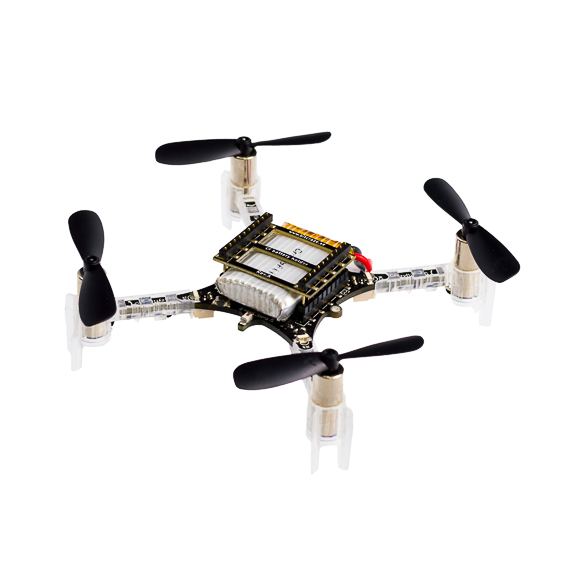

##Crazyflie

This repository contains **Python scripts** and **step-by-step guides** for working with the **Crazyflie 2.1 nano quadcopter** using the Bitcraze Python library (**cflib**).

It includes examples for:
- **Setup + first flight**
- **Multi-drone discovery and control**
- **Two-drone / formation flight**
- **External tracking workflows (OptiTrack / motion capture)**
- **AI Deck setup and usage**

## Crazyflie 2.1

**Figure:** Crazyflie 2.1 nano quadcopter
Crazyflie product image courtesy of Bitcraze AB 
https://www.bitcraze.io/

## About the Crazyflie 2.1

The **Crazyflie 2.1** is a small open-source quadcopter designed for **research, education, and experimentation**. It weighs about **29 grams** and is controlled wirelessly from a computer using the **Crazyradio PA** USB dongle.

The Crazyflie supports:
- **Python-based control** through **cflib**
- **Real-time logging** of sensor data
- **Custom firmware development**
- **Expansion decks** for extra sensors and capabilities

## Main components (shown in the image)

- **Frame and arms**  
  The lightweight frame holds all components and distributes weight evenly. The four arms support the motors and propellers.

- **Motors and propellers**  
  Each arm has a coreless DC motor and propeller. Two spin clockwise and two spin counterclockwise to stabilize the drone and enable controlled motion.

- **Main deck (flight controller)**  
  The central circuit board contains the main processor (**STM32F405**) that runs the flight firmware. It reads sensors and adjusts motor speeds to keep the drone stable.

- **Radio and power management (nRF51)**  
  A secondary microcontroller handles **wireless communication** and **power-related functions**.

- **Battery**  
  A small LiPo battery powers the system. It connects to the main board and can be charged through the USB port.

- **Expansion deck connectors**  
  Pins on top of the main board allow add-on decks. Expansion decks add features such as:
  - **Optical flow positioning (Flow Deck)**
  - **AI processing + camera (AI Deck)**
  - **External positioning systems**
  - **Custom sensors / hardware**

---

## Sensors (onboard)

The Crazyflie includes built-in sensors that enable stable flight:
- **Accelerometer + gyroscope** for motion sensing
- **Barometer** for altitude estimation
- **Magnetometer** (depending on configuration)

## Repository overview

This repository builds on the Crazyflie platform with practical examples and experiments:

- **GettingStarted with Crazyflie**  
  Setup instructions and first flight scripts.

- **Multidrone**  
  Scripts for discovering and controlling multiple Crazyflies.

- **formationflight**  
  Two-drone synchronized flight examples.

- **OptiTrack Motion Capture**  
  External motion capture integration for position tracking.

- **AI Deck**  
  Materials and resources related to AI Deck usage.

## Additional resources

- **Official Crazyflie product page:** https://www.bitcraze.io/products/old-products/crazyflie-2-1/  
- **Bitcraze documentation:** https://www.bitcraze.io/documentation/  
- **Crazyflie Python library (cflib):** https://github.com/bitcraze/crazyflie-lib-python  
- **Crazyflie firmware:** https://github.com/bitcraze/crazyflie-firmware  
- **Crazyflie client (cfclient):** https://github.com/bitcraze/crazyflie-clients-python  
- **Expansion decks overview:** https://www.bitcraze.io/documentation/repository/crazyflie-firmware/master/deck/  
- **Bitcraze tutorials:** https://www.bitcraze.io/category/tutorials/
